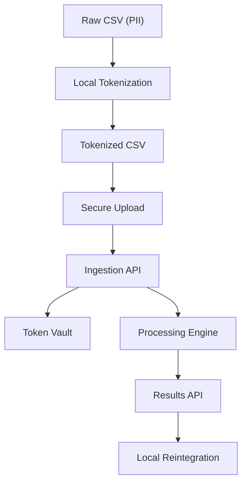

# Secure Data Pipeline (SDP)

## Overview

The Secure Data Pipeline (SDP) provides a full workflow for processing sensitive customer data without ever exposing Personally Identifiable Information (PII) to your server.

Data is tokenized locally, uploaded securely, processed server-side, and finally reintegrated locally with the original raw data.

### Key Features

* PII never leaves the client machine
* Encrypted token vault stored locally
* API-authenticated ingestion
* Reversible and non-reversible tokens supported
* Dockerized server + PostgreSQL backend

---

## End-to-End Workflow

1.  End-to-End Tokenization
2.  Secure Upload
3.  Server Ingestion
4.  Analytics
5.  Local Reintegration

### System Architecture




-----

## 1\. Client Components

**Location:** `client/sdp_client/`

### 1.1 Tokenization

#### A. Tokenize via Command Line

Tokenize a CSV by specifying a single column:

```bash
python -m sdp_client.cli tokenize-csv \
  --input data/customers_raw.csv \
  --output data/customers_tokenized.csv \
  --source-table customers \
  --column email
```

#### B. Tokenize via YAML Config

Define all tokenization rules in a YAML file (e.g., `configs/customers_tokenization.yml`).

```bash
python -m sdp_client.cli tokenize-config \
  --config configs/customers_tokenization.yml \
  --input data/customers_raw.csv \
  --output data/customers_tokenized_from_cfg.csv
```

**Functionality:**

  * Generates a tokenized non-PII CSV.
  * Stores encrypted originals in a local SQLite vault: `token_vault.db`.
  * Uses **AES-GCM** with your crypto key:

<!-- end list -->

```bash
# Example for Windows (PowerShell)
$env:SDP_CRYPTO_KEY = "Miql-SH11OTpm4rFOh5QF7iNG2fPolSwwvvb1YceREw="
```

### 1.2 Upload Batch to Server

Set your API key (required):

```bash
# Example for Windows (PowerShell)
$env:SDP_API_KEY = "dev-secret-api-key"
```

Upload a batch:

```bash
python -m sdp_client.cli upload-batch \
  --file data/customers_tokenized_from_cfg.csv \
  --client-id bank_demo \
  --processing-type risk_scoring \
  --server-url http://localhost:8081
```

**Example Server Response:**

```json
{
  "batch_id": "a241d5d5-9746-4f28-bbaa-f465a4f9e5f8",
  "accepted_records": 3,
  "status": "RECEIVED"
}
```

### 1.3 Dev Processing (Simulated ML Scoring)

Trigger server-side processing:

```powershell
$batchId = "YOUR-BATCH-ID"

Invoke-WebRequest `
  -Uri "http://localhost:8081/dev/process-batch/$batchId" `
  -Method POST |
  Select-Object -ExpandProperty Content
```

**Expected Output:**

```json
{
  "batch_id": "...",
  "processed_records": 3,
  "model_version": "demo_v1",
  "status": "PROCESSED"
}
```

### 1.4 Retrieve & Integrate Results with Raw CSV

Retrieve and merge scores locally:

```bash
python -m sdp_client.cli integrate-results \
  --batch-id <batch-id> \
  --raw-input data/customers_raw.csv \
  --output data/customers_with_scores.csv \
  --key-column customer_id \
  --server-url http://localhost:8081
```

**Result:** `customers_with_scores.csv` containing:

  * Raw customer data
  * Model risk scores
  * Model version metadata

-----

## 2\. Server Components

**Location:** `server/ingestion_api/`

### 2.1 Technologies

| Technology | Role |
| :--- | :--- |
| **FastAPI** | REST API framework. |
| **PostgreSQL** | Token vault + batch metadata persistence. |
| **SQLAlchemy ORM** | Database interaction layer. |
| **AES-GCM** | Encryption for original values in the vault. |
| **API Key Auth** | Authentication via `X-API-Key` header. |
| **Docker** | Containerization environment. |

### 2.2 Key Endpoints

| Endpoint | Method | Description |
| :--- | :--- | :--- |
| `/api/v1/process` | `POST` | Upload a batch of tokenized records. |
| `/dev/process-batch/{batch_id}` | `POST` | Dev-only simulated ML scoring trigger. |
| `/api/v1/results/{batch_id}` | `GET` | Return processed scores for a batch. |
| `/health` | `GET` | Simple service health probe. |

-----

## 3\. Docker Infrastructure

**Location:** `infra/docker-compose.yml`

### Starting the Full Stack

```bash
docker compose up -d
```

### Health Check

```bash
curl http://localhost:8081/health
```

**Expected:**

```json
{"status":"ok","service":"ingestion_api"}
```

-----

## 4\. Environment Variables

| Variable | Scope | Description |
| :--- | :--- | :--- |
| `SDP_CRYPTO_KEY` | client + server | AES-GCM encryption key. |
| `SDP_API_KEY` | client + server | API key (header `X-API-Key`). |
| `DB_DSN` | server | PostgreSQL DSN. |
| `SDP_ENV` | server | Environment mode (`dev`). |

-----

## 5\. Database Schema

**Tables:**

  * `token_vault` – Encrypted originals + tokens.
  * `processing_batch` – Tracking client uploads.
  * `tokenized_record` – Each uploaded tokenized row.
  * `processed_result` – Scoring results.

-----

## 6\. End-to-End Example (Full Pipeline)

```bash
# 1) Tokenize
python -m sdp_client.cli tokenize-config --config configs/customers_tokenization.yml ...

# 2) Upload tokenized CSV
python -m sdp_client.cli upload-batch ...

# 3) Process (dev)
Invoke-WebRequest -Uri http://localhost:8081/dev/process-batch/<batchId> -Method POST

# 4) Integrate results with raw PII
python -m sdp_client.cli integrate-results ...
```

**Result:**

  * Raw PII stays local
  * Tokenized data processed securely
  * Scores merged locally

-----

## 7\. Current Status

This implementation currently provides:

  * Local deterministic & config-driven tokenization
  * AES-GCM encrypted token vault
  * Upload client with TLS support
  * Server ingestion API
  * Dev-only ML simulator
  * End-to-end tested integration

-----

## 8\. Future Roadmap

  * Production ingestion workers 
  * mTLS between client ↔ server
  * Advanced ML scoring pipeline
  * Stream/real-time ingestion
  * Admin dashboard for batches
  * Secure key rotation tools
